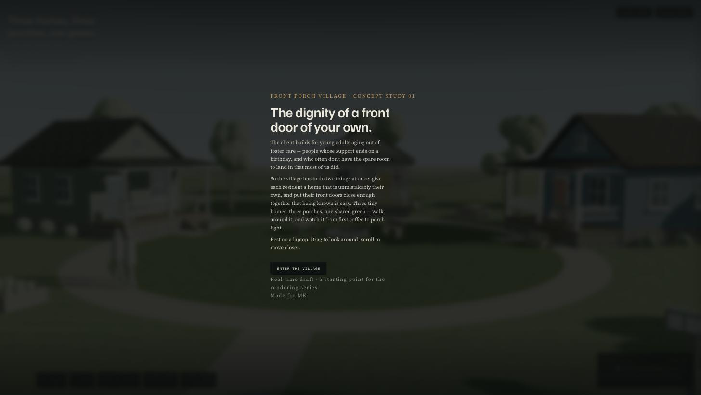
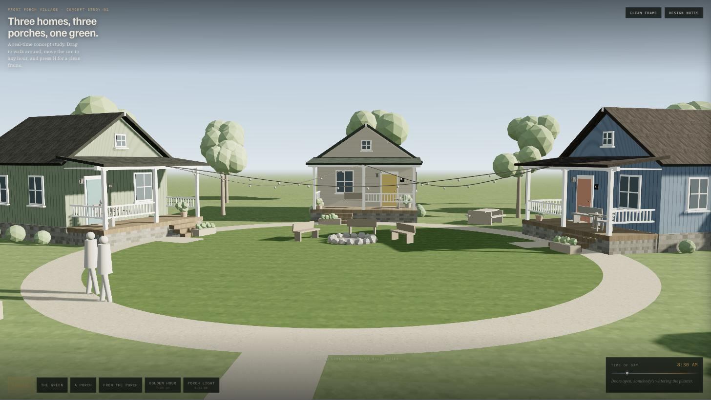
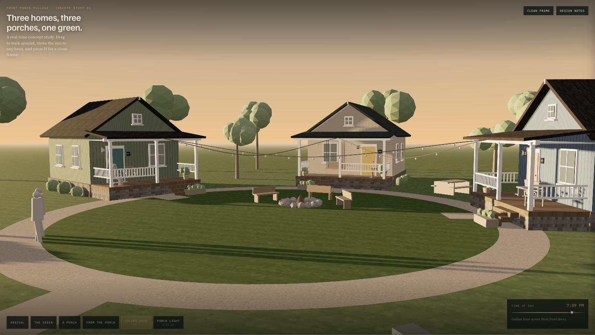

# Front Porch Village — interactive concept study

A self-contained, real-time 3D concept study built for a Taproot
opportunity: *3D Concept Rendering — Tiny Homes & Front Porch Community*.

Three individual tiny homes with deep front porches, arranged in a shallow
horseshoe around a shared green. It runs in a browser, at any hour of the day,
and you can walk around it.

**→ [Open the live demo](https://front-porch-village.pages.dev)**

**File:** `front-porch-village.html` — one file, no build step, no assets.
Open it in any modern browser, or publish it as a link.

> Pro bono / non-profit consulting project, built from a brief. The commissioning
> organisation is not named here.

  
   
  <em>The thesis before the geometry: three front doors close enough that being
  known is easy.</em>

  
   
  <em>8:30 AM. Three homes, three porches, one green. Drag to walk around it.</em>

  
   
  <em>7:09 PM, the same geometry. The time-of-day slider is the argument: a still
  image has to pick one moment, this one does not have to yet.</em>

## Why interactive, for this brief

The brief asks for a rendering that communicates *both home and neighborliness*.
A still image has to pick one moment and argue for it. This picks none of them
yet — which is the point at concept stage:

- **The porch relationship is spatial, so let people stand in it.** The
  "From the porch" view puts the camera at seated eye height on Home 01's porch,
  looking across the green at Home 03. That relationship is the entire idea and
  it is very hard to prove in a single frame.
- **Light is half the emotion.** The time-of-day slider runs 6:00 am to 9:36 pm.
  The same geometry reads as a bright, safe morning and as a warm, gathered
  evening. MK can decide which one the final rendering should be *after*
  seeing both.
- **Feedback is cheap here and expensive later.** Move a home, widen a porch,
  change a door color — a variable, not a re-render.
- **It doubles as a still generator.** Press `H` (or "Clean frame") to hide every
  panel; screenshot for the donor deck.

This is the concept stage of the work, deliberately. The final deliverable is
high-resolution rendering matched to the Amphitheatre standard — this exists to
settle composition, siting, massing, materials, and light before that render
starts.

## What's in the scene

| | |
|---|---|
| Homes | 3, ~20′×21′ footprint, front-facing gable, 8′-deep porches at 2′-6″ above grade |
| Home 01 | Sage board-and-batten, deep green door, two rockers, ferns |
| Home 02 | Warm putty lap siding, mustard door, hanging porch swing |
| Home 03 | Slate blue, coral door, built-in bench and bistro table |
| Site | ~62′ green, 5′ accessible loop path, spur paths to each porch |
| Shared | Fire ring and benches, two raised garden beds, picnic table, mailbox bank |
| Light | Keyframed sun elevation/azimuth/color, sky gradient, fog, window glow, porch lanterns, string lights, firelight |

Views: Arrival · The green · A porch · From the porch · Golden hour · Porch light.
Controls: drag to orbit, scroll or pinch to move closer, shift-drag or right-drag
to pan, arrow keys to nudge, `H` for a clean frame, `Esc` to close panels.

## Editing it

Everything is generated in code, so the design decisions are all named variables
near the top of the script block:

- `HOMES[]` — per-home angle, radius, siding, roof, door, furniture, porch type,
  roof pitch, and door/window placement.
- `FL`, `WALL_H`, `PORCH_D`, `PORCH_CEIL` — floor height, plate height, porch
  depth, porch ceiling. The dimensions quoted in the Design notes drawer come
  from these.
- `KEYS[]` — the time-of-day keyframes (sun angle and color, sky, fog, exposure,
  how "night" the scene is).
- `VIEWS[]` — camera presets, as explicit `pos`/`look` pairs.
- `TREES[]` — canopy placement, deliberately kept off the main sight lines.

Materials are procedural canvas textures (`lapCanvas`, `battenCanvas`,
`shingleCanvas`, `deckCanvas`, grass, gravel, stone), so a color change is one
hex value, not a new texture file.

Rendering: Three.js r128 (UMD, from CDN), ACES filmic tone mapping, soft shadow
maps, a gradient sky dome shader.

## Pitch text for the Taproot application

> I build interactive 3D concept studies — and I made one for your porch idea
> before writing this, so you can judge the work instead of the pitch: [link]
>
> Three tiny homes with 8′ porches around a shared green. Drag to walk around it;
> move the slider to see it from first coffee to porch light. The "From the porch"
> view puts you in a chair on Home 01's porch looking across at your neighbor's —
> which is the relationship your brief is really about, and the thing a single
> still image struggles to prove.
>
> I'd want to work this way with you: fast, cheap, arguable concept passes to
> settle siting, porch depth, massing, materials, and time of day together — then
> take the framing you approve into high-resolution rendering matched to the
> Amphitheatre's quality, with stills for the donor deck and an optional walk-up
> animation on the arrival path.
>
> Everything in the study is a variable, including all of it. Tell me what's wrong
> and you'll see it changed in the same conversation.

## Hosting it as a standalone page

`front-porch-village.html` is authored as a body fragment (it carries its own
`<title>`, `<link>` and `<style>`, but no document skeleton). To get a page you
can host anywhere:

    python3 build_standalone.py

That writes `site/`:

- `site/index.html` — the whole study in one file, with a real `<head>`
- `site/robots.txt` — `Disallow: /`
- `site/_headers` — `X-Robots-Tag: noindex, nofollow, noarchive` for hosts that read it
  (Netlify, Cloudflare Pages)

The page is marked **noindex, nofollow, noarchive, nosnippet, noimageindex** in
three places — the meta tag, a googlebot-specific tag, and robots.txt — so it
stays a link-only draft rather than something a donor finds by searching. It
carries no analytics, no trackers and no third-party embeds. The only outbound
requests are Three.js from cdnjs and the three typefaces from Google Fonts; drop
local copies beside the file if you want it fully self-contained and offline.

Drag `site/` onto Netlify Drop, or point any static host at it. GitHub Pages
works too, but note that Pages repos are public and Pages ignores `_headers` —
the meta tags and robots.txt still apply.

Re-run the build after any edit to `front-porch-village.html`; `site/` is a
generated artifact, not a second copy to maintain.

## Local preview note

The page loads Three.js from `cdnjs.cloudflare.com` and fonts from Google Fonts.
If you're on a network that blocks those, drop a local copy of `three.min.js`
(r128) beside the file and point the `<script src>` at it — nothing else is
external.
